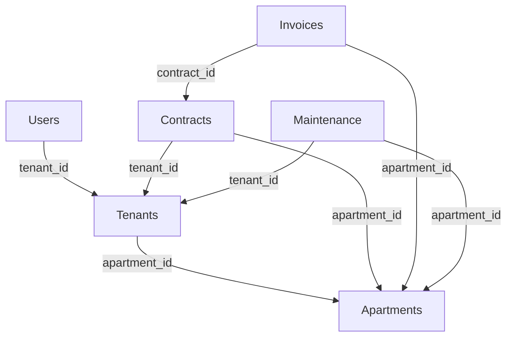

# 🏢 CRM Apartment Database Setup - Raspberry Pi 3B

Hướng dẫn đầy đủ thiết lập MariaDB cho hệ thống CRM quản lý căn hộ trên Raspberry Pi 3B

## 📑 Tổng quan

### Kiến trúc hệ thống
- **Server**: Raspberry Pi 3B (1GB RAM, ARM Cortex-A53)
- **OS**: Raspberry Pi OS Lite
- **Database**: MariaDB 10.3+
- **Storage**: MicroSD Card (khuyến nghị 32GB+)

### Tính năng chính
- ✅ Quản lý users với 3 cấp quyền (admin, manager, user)
- ✅ Quản lý apartments và contracts
- ✅ Quản lý tenants và invoices
- ✅ Hệ thống audit logs
- ✅ Backup tự động và monitoring
- ✅ Tối ưu hóa cho Pi 3B

## 🚀 Triển khai nhanh

### Bước 1: Cài đặt MariaDB
```bash
# Chạy script setup
bash setup-mariadb-pi.md
```

### Bước 2: Tạo database và tables
```bash
# Tạo database schema
mysql -u root -p < database-schema.sql
```

### Bước 3: Khởi tạo dữ liệu
```bash
# Insert dữ liệu mẫu và cấu hình users
mysql -u root -p < database-init.sql
```

### Bước 4: Thiết lập automation
```bash
# Cấu hình backup và monitoring
bash setup-automation.md
```

## 👤 Phương án quản lý tài khoản

### 1. Database Users
| User | Password | Quyền | Mục đích |
|------|----------|-------|----------|
| `crm_app` | `CrmApp2024#SecurePassword` | SELECT, INSERT, UPDATE, DELETE | Ứng dụng chính |
| `crm_readonly` | `CrmReadOnly2024#` | SELECT | Backup và reports |
| `crm_admin` | `CrmAdmin2024#VerySecure` | ALL | Maintenance |

### 2. Application Users (trong bảng users)
| Role | Quyền hạn | Mô tả |
|------|-----------|-------|
| **admin** | Toàn quyền | Quản lý tất cả users, apartments, contracts |
| **manager** | Hạn chế | Chỉ quản lý users với role 'user', xem reports |
| **user** | Chỉ đọc | Xem thông tin cá nhân, hóa đơn của mình |

### 3. Security Features
- ✅ Password hashing với bcrypt
- ✅ Session management
- ✅ Role-based access control
- ✅ Audit logging
- ✅ Network access restrictions

## 🗄️ Database Schema

### Bảng chính
```
users (5 records)           - Tài khoản hệ thống
├── apartments (11 records) - Thông tin căn hộ  
├── tenants (3 records)     - Khách thuê
├── contracts (2 records)   - Hợp đồng thuê
├── invoices (5 records)    - Hóa đơn
├── costs (6 records)       - Chi phí chung
├── maintenance_requests    - Yêu cầu sửa chữa
└── audit_logs             - Lịch sử thay đổi
```

### Quan hệ chính


## 🛠️ Tính năng nâng cao

### 1. Automatic Backup
- Backup hàng ngày lúc 2:00 AM
- Nén và lưu trữ 7 ngày
- Xóa tự động backup cũ

### 2. Performance Monitoring
- Kiểm tra disk space mỗi giờ
- Monitor database connections
- Slow query logging

### 3. Maintenance Tasks
- Database optimization hàng tuần
- Log cleanup hàng tháng
- Health check định kỳ

## ⚡ Performance Optimization

### MariaDB Configuration
```ini
# Tối ưu cho Pi 3B (1GB RAM)
innodb_buffer_pool_size = 256M
max_connections = 30
query_cache_size = 32M
```

### Indexing Strategy
- Primary keys trên tất cả bảng
- Foreign key indexes
- Search indexes (username, phone, email)
- Composite indexes cho queries phức tạp

## 🔐 Security Best Practices

### 1. Network Security
```bash
# Firewall rules
sudo ufw allow from 192.168.0.0/16 to any port 3306
sudo ufw deny 3306
```

### 2. Database Security
- Separate users với quyền tối thiểu
- Strong passwords với rotation
- No root remote access
- SSL/TLS encryption (optional)

### 3. Application Security
- bcrypt password hashing
- Session timeout
- Input validation
- SQL injection protection

## 📊 Monitoring và Alerting

### 1. Automated Checks
- Database connectivity
- Disk space usage
- Memory utilization
- Connection count

### 2. Alert Thresholds
- Disk usage > 80%
- DB connections > 40
- Database size > 500MB
- Query time > 2 seconds

## 🔧 Troubleshooting

### Common Issues

**1. Pi 3B hiệu suất thấp**
```bash
# Kiểm tra memory usage
free -h
# Kiểm tra CPU
top
# Optimize MariaDB
sudo systemctl restart mariadb
```

**2. Disk space đầy**
```bash
# Chạy cleanup
/usr/local/bin/database-maintenance.sh cleanup
# Xóa backup cũ
find /home/pi/crm_backups -name "*.sql.gz" -mtime +3 -delete
```

**3. Kết nối database lỗi**
```bash
# Kiểm tra service
sudo systemctl status mariadb
# Restart service
sudo systemctl restart mariadb
# Check logs
sudo tail -f /var/log/mysql/error.log
```

## 📞 Kết nối từ ứng dụng

### Connection String Examples

**Node.js (mysql2)**
```javascript
const mysql = require('mysql2');
const connection = mysql.createConnection({
  host: 'YOUR_PI_IP',
  user: 'crm_app',
  password: 'CrmApp2024#SecurePassword',
  database: 'crm_apartment'
});
```

**Python (PyMySQL)**
```python
import pymysql
connection = pymysql.connect(
    host='YOUR_PI_IP',
    user='crm_app',
    password='CrmApp2024#SecurePassword',
    database='crm_apartment'
)
```

## 📈 Scaling Considerations

### Khi nào cần nâng cấp:
- Database size > 1GB
- Concurrent users > 10
- Response time > 3 seconds
- Disk I/O bottleneck

### Phương án nâng cấp:
1. **Pi 4 8GB** - Tăng RAM và CPU
2. **SSD Storage** - Cải thiện I/O
3. **Load Balancer** - Multiple Pi instances
4. **Cloud Migration** - MySQL/PostgreSQL cloud

## 📝 Checklist triển khai

- [ ] Cài đặt Pi OS Lite
- [ ] Update system packages
- [ ] Cài đặt MariaDB
- [ ] Cấu hình security
- [ ] Tạo database schema
- [ ] Insert dữ liệu mẫu
- [ ] Thiết lập users và permissions
- [ ] Cấu hình backup automation
- [ ] Setup monitoring
- [ ] Test kết nối từ app
- [ ] Test backup/restore
- [ ] Cấu hình firewall
- [ ] Document passwords

## 🎯 Kết luận

Hệ thống database này được thiết kế đặc biệt cho Raspberry Pi 3B với:
- **Hiệu suất tối ưu** cho hardware hạn chế
- **Bảo mật cao** với multiple layers
- **Backup tự động** và disaster recovery
- **Monitoring proactive** để phát hiện sớm vấn đề
- **Scalability** cho tương lai

**Tài khoản mặc định để test:**
- Admin: `admin` / `admin123`
- Manager: `manager1` / `manager123`  
- User: `nguyenvanan` / `user123`

**⚠️ Lưu ý quan trọng:**
- Thay đổi tất cả passwords mặc định
- Enable firewall trước khi expose ra internet
- Backup database trước khi update
- Monitor disk space thường xuyên 